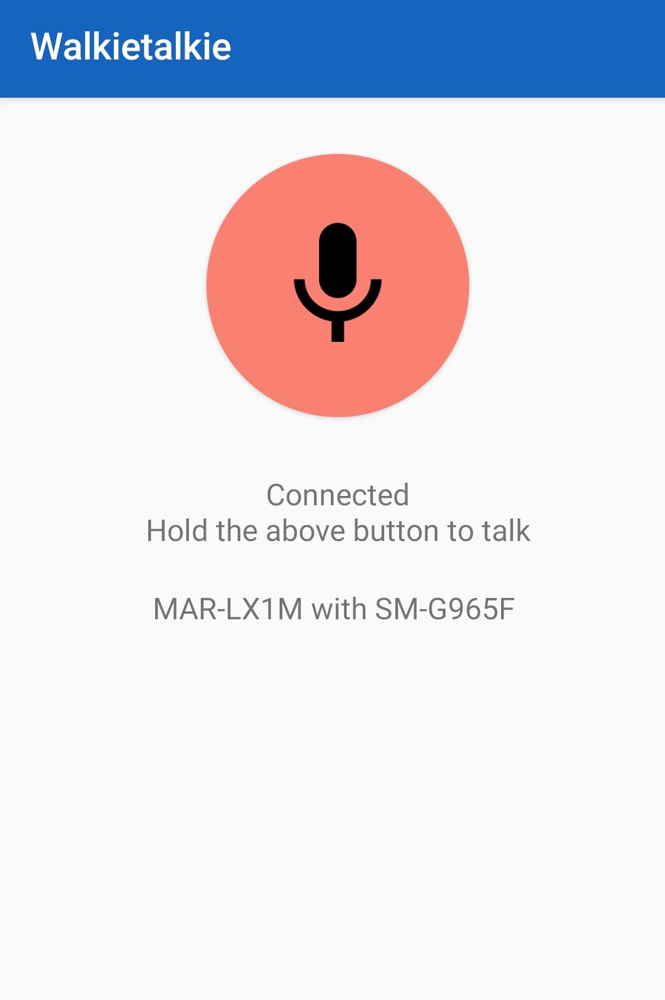

# WalkieTalkie

This project is a Xamarin.Android project that provides a simple WalkieTalkie app developed using Huawei HMS Nearby Service. Two or more devices can communicate by voice without the need to connect to internert.

 
 

## Getting Started

To run this app, you need to be a registered as Huawei Mobile Developer and create an application in Huawei App Console in order to use HMS Nearby Service. You can follow these steps to complete the configuration that required for development:

1. [Configuring App Information in AppGallery Connect](https://developer.huawei.com/consumer/en/doc/development/HMS-Plugin-Guides/config-agc-0000001062955576)
2. [Installing the Huawei Nearby Service NuGet package](https://developer.huawei.com/consumer/en/doc/development/HMS-Plugin-Guides/integrating-nearby-kit-0000001088458734)
3. [Integrating the HMS Core SDK](https://developer.huawei.com/consumer/en/doc/development/HMS-Plugin-Guides/integrating-sdk-0000001088170580)
5. [Setting Package information in Xamarin](https://developer.huawei.com/consumer/en/doc/development/HMS-Plugin-Guides/setting-package-0000001088619462)

## References

- [Official Nearby Service documnet](https://developer.huawei.com/consumer/en/doc/development/HMS-Plugin-Guides/introduction-0000001062477568)